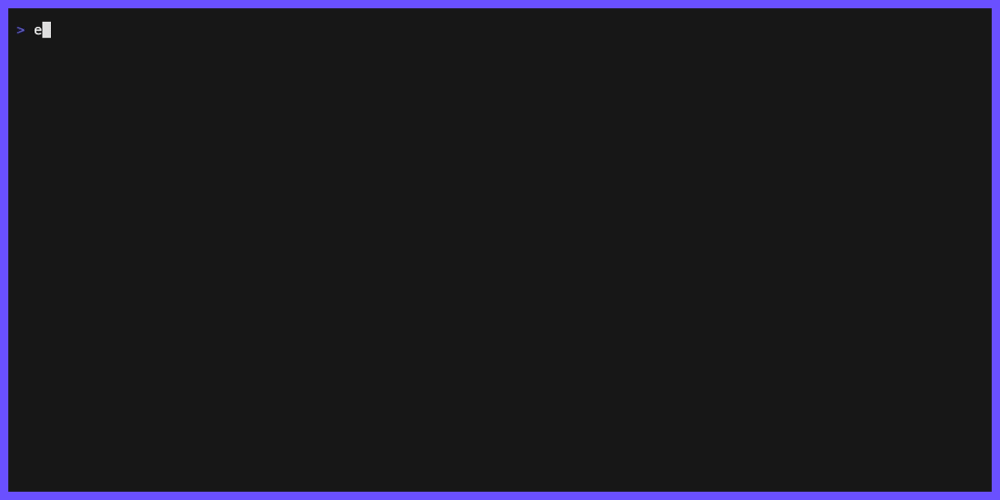
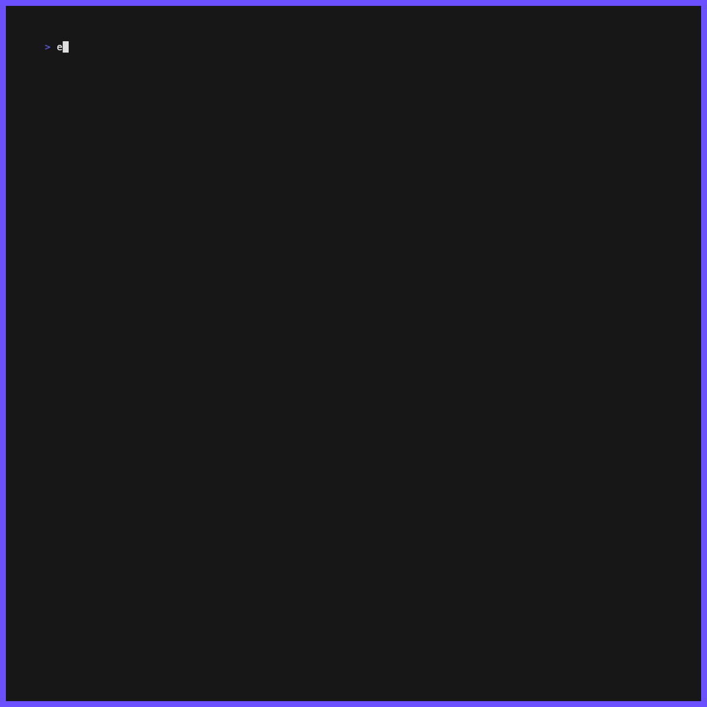

[![Go Version][go-version-img]][go-version]
[![GitHub Release][release-img]][release]
[![Test][test-img]][test]
[![Go Report Card][go-report-img]][go-report]
[![License: MIT][license-img]][license]

<div align="center">
<strong>Opinionated Terraform scaffolding for real-world teams. No vendor lock-in, just better project structure</strong>
</div>

# tfskel

tfskel is a CLI tool that scaffolds Terraform monorepos with an **opinionated**, **scalable** and **consistent** way by using environment-based directory structure across multiple regions. No wrappers, no complexity, just vanilla Terraform with consistent backend configs, version **drift detection**, **terraform plan analysis**, and sensible defaults. Spend less time on project setup and more time writing infrastructure code.

<p align="left">
  
</p>

## What It Does

- **Scaffolds production-ready Terraform monorepos** organized by environment (dev/stg/prd) and region.
- **Generates AWS backend & provider configs** using reusable Go templates with smart defaults.
- **Detects version drift** across Terraform and provider versions in entire repositories—catch inconsistencies before they cause production issues.
- **Analyzes Terraform plans** to surface resource changes, impact severity, and compliance risks at a glance.
- **Safe and idempotent** creates new files without overwriting existing infrastructure code.
- **Works with vanilla Terraform** no custom wrappers, no vendor lock-in, just better project structure.

## tfskel in Action

#### Terraform and AWS provider version drift
<p align="left">

</p>

#### Terraform plan analysis
<p align="left">

</p>

## Installation

```bash
# Install via Go
go install github.com/ishuar/tfskel@latest

# Or download from releases
# https://github.com/ishuar/tfskel/releases
```

Make sure `$HOME/go/bin` is in your PATH.

## Configuration

Create a `.tfskel.yaml` in your project root to customize defaults:

```yaml
terraform_version: ~> 1.13
templates_dir: "/path/to/your/templates-directory" # Custom templates_dir
extra_template_extensions: ["md.tmpl"] # by default .tf.tmpl templates are processed only
backend:
  s3:
    bucket_name: CHANGE_ME_WITH_YOUR_GLOBALLY_UNIQUE_S3_BUCKET_NAME
provider:
  aws:
    version: ~> 6.0
    default_tags:
      - generated_by: tfskel
    regions:
      - eu-central-1
    account_mapping:
      dev: "123456789012"
      prd: "210987654321"
      stg: "109876543210"
```
> [!TIP]
> Use [.tfskel.yaml.example](.tfskel.yaml.example) for reference.
> Configuration precedence: CLI flags → config file → defaults

## Quick Start
1. Help and available commands

```bash
tfskel --help
```
2. Initialize a new Terraform monorepo:

```bash
# Create project structure with default config
tfskel init

# Or specify a custom directory
tfskel init --dir /path/to/your/project
```

- This creates an opinionated structure with environment directories and configuration files:

```
.
├── .tfskel.yaml             # Project configuration
├── .gitignore               # Terraform-specific ignores
├── .pre-commit-config.yaml  # Pre-commit hooks
├── .tflint.hcl             # Linting config
├── trivy.yaml              # Security scanning config
└── envs/
    ├── dev/
    │   ├── .terraform-version
    │   └── eu-central-1/
    ├── stg/
    │   ├── .terraform-version
    │   └── eu-central-1/
    └── prd/
        ├── .terraform-version
        └── eu-central-1/
```

3. Generate Terraform code for a specific application:

```bash
tfskel generate myapp --env dev --region us-east-1
```
- Running `tfskel generate` creates a complete Terraform module directory with backend and version configuration

```bash
  envs/dev/us-east-1/myapp/
  ├── backend.tf       # S3 backend with state locking & encryption enabled
  └── versions.tf      # Terraform and provider versions
```

```bash
## custom templates directory via cmd arguments, otherwise use .tfskel.yaml config else default templates
tfskel generate myapp --env dev --region us-east-1 --templates-dir <path-to-templates-dir>
```
> [!TIP]
> You can extend this by creating custom go templates for additional files (`main.tf`, `variables.tf`, `outputs.tf`, etc.).
> Place templates in a directory, config accordingly and tfskel will use them alongside the defaults.

## Drift Detection

**Why it matters:** In large repos and monorepos, version inconsistencies can cause failed deployments, security vulnerabilities, and hours of debugging. Plan analysis helps you assess change impact before applying.

**Version Drift Detection**
```bash
# Scan repository for version inconsistencies
tfskel drift version --path ./envs

# Output as JSON for CI/CD pipelines
tfskel drift version --format json > drift-report.json
```

> [!Tip]
> ref to [tfskel-in-action](#terraform-and-aws-provider-version-drift)

**Terraform Plan Analysis**
```bash
# Analyze plan after terraform plan -out=plan.bin
terraform plan -out plan.bin
terraform show -json plan.bin > plan.json
tfskel drift plan --plan-file plan.json

# Export as CSV for reporting
tfskel drift plan --plan-file plan.json --format csv
```

> [!Tip]
> ref to [tfskel-in-action](#terraform-plan-analysis)

**Combined Analysis**
```bash
# Run both version drift and plan analysis
tfskel drift all --plan-file plan.json
```

## Contributing
Contributions welcome! See [CONTRIBUTING.md](CONTRIBUTING.md) for guidelines.
1) Fork the repository on GitHub
2) Clone your fork and create a new branch
3) Make your changes
4) Run tests and checks
5) Push your branch and open a pull request

```bash
git clone https://github.com/<your-username>/tfskel.git
cd tfskel
git checkout -b my-feature-branch
make test   # Run tests
make check  # Run all quality checks
```
> [!Important]
> Please keep your pull requests small and focused. This will make it easier to review and merge.

## License

MIT License - see [LICENSE](LICENSE) file for details.

[go-version-img]: https://img.shields.io/badge/Go-1.24%2B-blue.svg
[go-version]: https://golang.org
[test]: https://github.com/ishuar/tfskel/actions/workflows/test.yaml
[test-img]: https://github.com/ishuar/tfskel/actions/workflows/test.yaml/badge.svg
[go-report]: https://goreportcard.com/report/github.com/ishuar/tfskel
[go-report-img]: https://goreportcard.com/badge/github.com/ishuar/tfskel
[release]: https://github.com/ishuar/tfskel/releases
[release-img]: https://img.shields.io/github/release/ishuar/tfskel.svg?logo=github
[license]: https://github.com/ishuar/tfskel/blob/main/LICENSE
[license-img]: https://img.shields.io/badge/MIT-blue.svg
