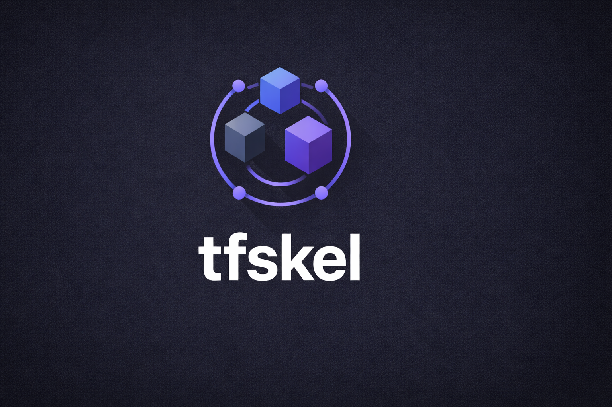
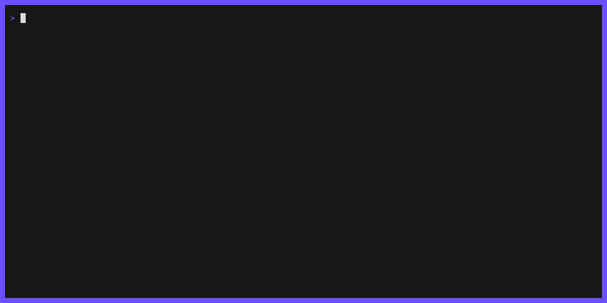
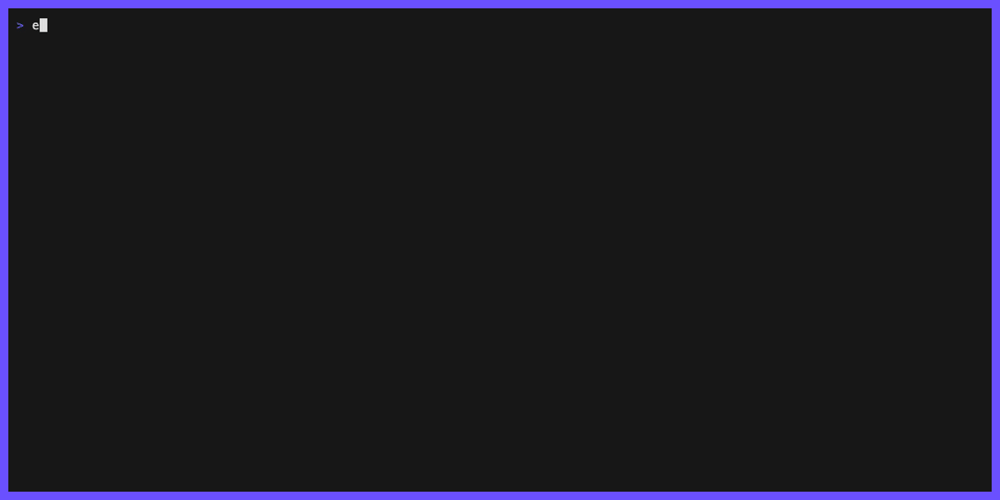

<div align="center">
<!--  -->

[![Test][test-img]][test]
[![GitHub Release][release-img]][release]
[![License: MIT][license-img]][license]
[![Stargazers][stars-shield]][stars-url]
[![Go Report Card][go-report-img]][go-report]
[](https://codecov.io/gh/ishuar/tfskel)
[![Go Version][go-version-img]][go-version]

<div align="center">


<em>Simplified and predictable Terraform operations. Scale & Build infrastructure, not overhead!</em>
</div>

</div>

# tfskel

[`tfskel`](https://github.com/ishuar/tfskel) is a CLI tool that helps you run Terraform without the operational chaos.

It standardizes project structure, reduces drift, and makes plans easier to reason about, so you can spend less time managing Terraform and more time terraforming your infrastructure. No wrappers. No unnecessary abstraction. With `tfskel` Just well-structured, scalable Terraform that stays maintainable as you grow.

## Why tfskel

_Terraform itself isn’t hard. Managing it at scale is._

As infrastructure grows, so does the operational overhead — inconsistent folder structures, version drift, massive plan reviews, and environments slowly falling out of sync. Teams end up spending more time maintaining Terraform than actually building infrastructure.

[`tfskel`](https://github.com/ishuar/tfskel) removes that friction.

It gives you a clean, opinionated foundation that keeps your Terraform projects structured, consistent, and predictable from day one. Instead of reinventing layouts and fixing drift, you can focus on delivering Infrastructure as Code with confidence. _No copy-paste cycles. No structural chaos. No hidden abstraction layers._ Just well-organized, scalable Terraform — built to grow with your infrastructure.

> _tfskel is not a Terraform wrapper. It’s an operational discipline tool for Terraform._

### Features

1. Enforce consistent project structure across environments
2. Scaffold Terraform code using clean, maintainable templates
3. Upgrade generated files in-place when templates or config change (`--upgrade`)
4. Detect AWS provider and Terraform version drift across the entire repo
5. Analyze Terraform plans to make reviews easier and safer with custom resources severity
6. Stay vanilla — no wrappers, no lock-in, just Terraform

> [!NOTE]
> *⭐️ If you find tfskel useful, consider starring the repo to stay updated and support the project. ⭐️*

### Demo
👉 Check out this https://github.com/ishuar/tfskel-demo/pull/2 to see _how to initialize a new terraform monorepo in just 4 steps and leverage the built-in GitHub Actions workflows_:


## Installation

```bash
# Install via Go
go install github.com/ishuar/tfskel@latest

# Or download from releases
# https://github.com/ishuar/tfskel/releases
```
Make sure `$HOME/go/bin` is in your PATH.

> [!CAUTION]
> This project is developed with AI assistance. Please review the code carefully and perform your own due diligence. Thank you 🙏

## Quick Start

### Global Flags

These flags are available on every `tfskel` command:

| Flag | Short | Default | Description |
|---|---|---|---|
| `--config` | `-c` | `.tfskel.yaml` (current dir) | Path to config file; takes precedence over auto-discovery |
| `--verbose` | `-v` | `false` | Enable verbose/debug output |
| `--version` | | | Print the current tfskel version and exit |

```bash
# Print the installed tfskel version
tfskel --version

# Show all available commands and flags
tfskel --help

# Use a custom config file for any command
tfskel --config /path/to/my-config.yaml <command>

# Enable verbose logging
tfskel --verbose <command>
```

### `tfskel init`

Initializes a new Terraform monorepo with an environment-and-region-based directory layout (`dev`/`stg`/`prd`) with sensible defaults already in place — `.gitignore`, `.pre-commit-config.yaml`, `.tflint.hcl`, `trivy.yaml`, `.tfskel.yaml`, and per-environment `.terraform-version` files. The same structure, every time, across every project.

If a `.tfskel.yaml` already exists in the target directory, `init` reads environments from `provider.aws.account_mapping` and regions from `provider.aws.regions`, so your existing configuration drives the scaffold.

With `--workflows`, also generates the shared GitHub Actions reusable workflow files (`lint.yaml`, `reusable-detect-changes.yaml`, `reusable-terraform-plan-apply.yaml`, `reusable-lint.yaml`) under `.github/workflows/`. This can also be enabled via `workflows.create: true` in `.tfskel.yaml`.

| Flag | Short | Default | Description |
|---|---|---|---|
| `--dir` | `-d` | current directory | Directory to initialize |
| `--workflows` | | `false` | Generate shared GitHub Actions reusable workflow files |
| `--upgrade` | | `false` | Re-render init-managed files with latest embedded templates |
| `--force` | | `false` | With `--upgrade`, overwrite files even without source markers |

```bash
# Initialize in the current directory
tfskel init

# Initialize in a specific directory
tfskel init --dir /path/to/your/project

# Initialize with an explicit config file
tfskel init --config /path/to/config.yaml

# Also generate shared GitHub Actions workflow files
tfskel init --workflows

# Re-render init files (e.g. .pre-commit-config.yaml, .tflint.hcl) from latest templates
tfskel init --upgrade

# Force overwrite all init files, even those without source markers
tfskel init --upgrade --force
```

<p align="left">
  
</p>

### `tfskel scaffold`

It accepts any subcommand as an input for target app-dir and creates per-application root module directories with a pre-configured `backend.tf` (S3 with state locking and encryption) and a `versions.tf` with pinned Terraform and AWS provider versions. You can extend this with your own `.tmpl` files — any custom template you place in your templates directory is processed alongside the built-in defaults; if the same filename is provided, the custom template takes precedence.

| Flag | Short | Default | Description |
|---|---|---|---|
| `--env` | `-e` | *(required)* | Target environment (e.g. `dev`, `stg`, `prd`) |
| `--region` | `-r` | *(required)* | AWS region (e.g. `us-east-1`, `eu-central-1`) |
| `--templates-dir` | | `""` | Directory containing custom `.tmpl` template files |
| `--s3-bucket-name` | | `""` | S3 bucket name for Terraform state (overrides config) |
| `--upgrade` | | `false` | Re-render existing files from updated templates (only files with source markers) |
| `--force` | | `false` | With `--upgrade`, overwrite files even without source markers |

```bash
# Scaffold structure for an app in dev/us-east-1
tfskel scaffold myapp --env dev --region us-east-1

# Scaffold with a custom templates directory
tfskel scaffold myapp --env stg --region eu-central-1 --templates-dir ./templates

# Override S3 bucket name at runtime
tfskel scaffold myapp --env prd --region us-east-1 --s3-bucket-name my-tf-state-bucket

# Scaffold with a custom config file
tfskel scaffold myapp --config ./my-config.yaml --env dev --region us-east-1

# Using the short alias
tfskel sc myapp --env dev --region us-east-1

# Re-render scaffolded files after updating templates or config
tfskel scaffold myapp --env dev --region us-east-1 --upgrade

# Force overwrite all scaffolded files, even without source markers
tfskel scaffold myapp --env dev --region us-east-1 --upgrade --force
```


#### `tfskel scaffold workflows`

Generates a per-environment GitHub Actions Terraform plan/apply caller workflow. Run this once per environment after `tfskel init --workflows` has created the shared reusable workflow files.

| Flag | Short | Default | Description |
|---|---|---|---|
| `--env` | `-e` | *(required)* | Target environment (e.g. `dev`, `stg`, `prd`) |
| `--upgrade` | | `false` | Re-render existing workflow files from updated templates |
| `--force` | | `false` | With `--upgrade`, overwrite workflow files even without source markers |

```bash
# Generate a per-env Terraform workflow for dev
tfskel scaffold workflows --env dev

# Generate with a custom config file
tfskel scaffold workflows --env prd --config ./my-config.yaml

# Re-render an existing workflow after config changes
tfskel scaffold workflows --env dev --upgrade
```

Generated file: `.github/workflows/<env>-<name>.yaml`

> [!Note]
> `workflows.name` is a **plain string** (Go template syntax is not supported). The environment prefix and `.yaml` extension are added automatically. Example: with `name: "terraform"` and `--env dev`, the file will be `dev-terraform.yaml`.

<p align="left">

</p>

#### `tfskel diff config`

It scans all environments in the repository and reports Terraform and AWS provider version differences in one pass from the current directory. Results can be output as JSON, table, or CSV for use in CI/CD pipelines or automated checks.

| Flag | Short | Default | Description |
|---|---|---|---|
| `--dir` | `-d` | `.` (current dir) | Directory to scan for Terraform files (recursive) |
| `--format` | `-f` | `table` | Output format: `table`, `json`, `csv` |
| `--no-color` | | `false` | Disable colored output |

**Exit codes:**

| Code | Meaning |
|---|---|
| `0` | No drift — all files in sync |
| `1` | Drift detected (minor or major version differences) |
| `2` | Parse errors encountered while scanning `.tf` files |

```bash
# Check for drift in current directory
tfskel diff config

# Check a specific subdirectory
tfskel diff config --dir ./envs

# JSON output for CI/CD pipelines
tfskel diff config --dir ./envs --format json

# Generate a CSV report without ANSI colors
tfskel diff config --format csv --no-color > drift-report.csv
```

<p align="left">

</p>

#### `tfskel review plan`

Reads a `plan.json` file, summarizes resource changes, flags high-severity updates based on a configurable list of critical resources, and produces a structured report. Output can be exported as CSV, table, or JSON for reporting.

| Flag | Short | Default | Description |
|---|---|---|---|
| `--json-file` | | *(required)* | Path to the Terraform plan JSON file |
| `--format` | `-f` | `table` | Output format: `table`, `json`, `csv` |
| `--no-color` | | `false` | Disable colored output |

**Exit codes:**

| Code | Meaning |
|---|---|
| `0` | No changes — infrastructure is up to date |
| `1` | Non-critical changes detected (additions or modifications) |
| `2` | Critical changes detected (deletions or replacements) |

```bash
# Generate and analyze a Terraform plan
terraform plan -out plan.bin
terraform show -json plan.bin > plan.json
tfskel review plan --json-file plan.json

# Export as CSV for reporting
tfskel review plan --json-file plan.json --format csv

# JSON output without colors (suitable for log files)
tfskel review plan --json-file plan.json --format json --no-color
```

<p align="left">

</p>

## Upgrading Generated Files

tfskel embeds **source markers** (e.g. `## tfskel-source: {...}`) in every generated file (except `.terraform-version`). These markers record which template produced the file and its content hash, enabling safe, selective re-rendering with `--upgrade`.

> [!TIP]
> For more details on source markers, metadata tracking, and selective upgrade whitelists, see the [tfskel book](docs/tfskel-book.md#upgrading-generated-files).

## Configuration

Create a `.tfskel.yaml` in your project root to customize defaults:

> [!TIP]
> Use [.tfskel.example.yaml](.tfskel.example.yaml) for a full annotated reference.
> Configuration precedence: **CLI flags → config file → defaults**

### Template context variables

The following config fields accept Go template syntax: `backend.s3.bucket_name`, `workflows.aws_role_arn`, and `workflows.aws_role_name`.

All placeholders are populated from the `tfskel scaffold` invocation:

| Placeholder               | Source                                         | Description                                                                         | Example value                                          |
|---------------------------|------------------------------------------------|-------------------------------------------------------------------------------------|--------------------------------------------------------|
| `{{.AppDir}}`             | `<app-dir>` argument to `tfskel scaffold`      | Application directory name. Path separators `/` are replaced with `-` in filenames. | `myapp`, `base-infra-ecs`                              |
| `{{.Env}}`                | `--env` / `-e` flag                            | Target environment.                                                                 | `dev`, `stg`, `prd`                                    |
| `{{.Region}}`             | `--region` / `-r` flag                         | Full AWS region name.                                                               | `eu-central-1`, `us-east-1`                            |
| `{{.ShortRegion}}`        | Derived from `--region` / `-r` flag            | Abbreviated region (e.g. `eu-central-1` → `euc1`).                                  | `euc1`, `use1`                                         |
| `{{.AccountID}}`          | `provider.aws.account_mapping[.Env]`           | AWS account ID for the target environment.                                          | `123456789012`                                         |
| `{{.S3BucketName}}`       | `backend.s3.bucket_name` (post-render)         | Resolved S3 bucket name after template rendering.                                   | `my-tfstate-bucket`                                    |
| `{{.TerraformVersion}}`   | `terraform_version` in config                  | Terraform version constraint.                                                       | `~> 1.13`                                              |
| `{{.AWSProviderVersion}}` | `provider.aws.version` in config               | AWS provider version constraint.                                                    | `~> 6.0`                                               |
| `{{.AWSRoleArn}}`         | Resolved from `aws_role_arn` / `aws_role_name` | Final IAM role ARN used in workflow files.                                          | `arn:aws:iam::123456789012:role/dev-githubactionsrole` |
| `{{.WorkflowFileName}}`   | Auto-generated                                 | Rendered workflow filename (used for self-reference in workflow `on:` triggers).    | `dev-terraform.yaml`                                   |

#### Template functions

In addition to the standard Go `text/template` built-ins, additional [template functions](https://github.com/ishuar/tfskel/blob/main/docs/tfskel-book.md#string-checking-functions) are available in all templated config values.

## Contributing

Contributions are what make the open source community such an amazing place to learn, inspire, and create. Any contributions you make are greatly appreciated.

If you have any suggestion that would make this project better, feel free to fork the repo and create a pull request. You can also simply open an issue with the tag "enhancement" with your suggestion.

> [!Tip]
> See [CONTRIBUTING.md](CONTRIBUTING.md) for guidelines.

1) Fork the repository on GitHub
2) Clone your fork and create a new branch
3) Make your changes
4) Run tests and checks
5) Push your branch and open a pull request

```bash
git clone https://github.com/<your-username>/tfskel.git
cd tfskel
git checkout -b my-feature-branch
make test   # Run tests
make check  # Run all quality checks
```

> [!Important]
> Please keep your pull requests small and focused. This will make it easier to review and merge.

## License
Released under [MIT LICENSE](/LICENSE)

<p align="right"><a href="#top">Back To Top ⬆️</a></p>

<!-- MARKDOWN LINKS & IMAGES -->
<!-- https://www.markdownguide.org/basic-syntax/#reference-style-links -->

[go-version-img]: https://img.shields.io/badge/Go-1.24%2B-blue.svg
[go-version]: https://golang.org
[test]: https://github.com/ishuar/tfskel/actions/workflows/test.yaml
[test-img]: https://github.com/ishuar/tfskel/actions/workflows/test.yaml/badge.svg
[go-report]: https://goreportcard.com/report/github.com/ishuar/tfskel
[go-report-img]: https://goreportcard.com/badge/github.com/ishuar/tfskel
[release]: https://github.com/ishuar/tfskel/releases
[release-img]: https://img.shields.io/github/release/ishuar/tfskel.svg?logo=github
[license]: https://github.com/ishuar/tfskel/blob/main/LICENSE
[license-img]: https://img.shields.io/github/license/ishuar/tfskel?color=blue
[stars-url]: https://github.com/ishuar/tfskel/stargazers
[stars-shield]: https://img.shields.io/github/stars/ishuar/tfskel?style=flat&logo=github
